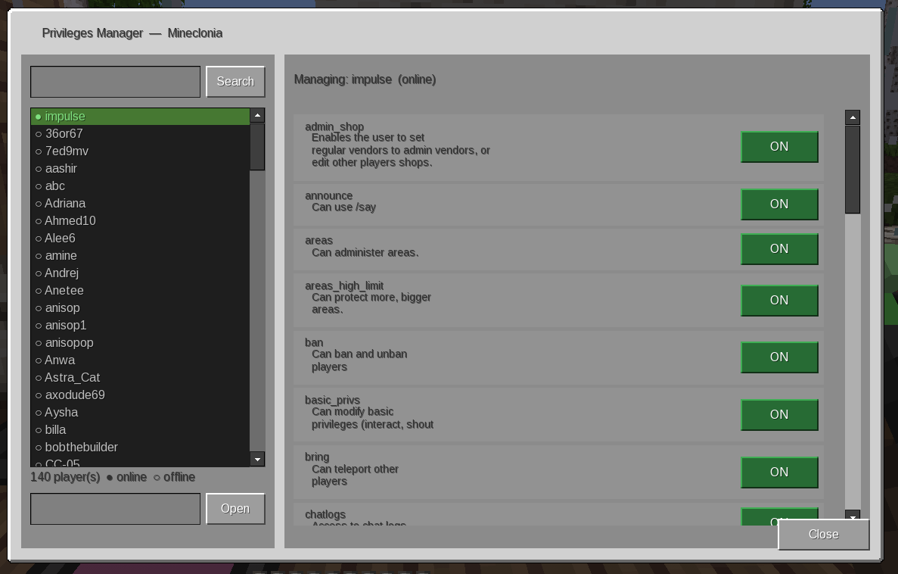

# Privileges Manager

A visual, searchable GUI for managing player privileges in Luanti (Minetest).
Works on **Minetest Game** and **Mineclonia / VoxeLibre**, and can manage
**offline players** as well as online ones.

## Features

- **Searchable player list** with a search bar — type part of a name and press
  **Enter** (or click *Search*) to filter. Online players are shown first
  (● green) above offline players (○ grey).
- **Toggle switches** for every registered privilege. Click a switch to grant
  (green **ON**) or revoke (grey **OFF**) instantly. Each switch shows the
  privilege description as a tooltip.
- **Offline player support** — every account known to the server's auth
  database is listed, so you can adjust privileges for players who aren't
  connected. You can also open any player by exact name (bottom-left field),
  which works even for accounts that don't exist yet.
- **Game-aware look** — the formspec uses real coordinates (formspec v4) and
  adapts its palette to Minetest Game or the Mineclone family automatically.
- **Respects the engine permission model** — you need the `privs` privilege to
  manage any privilege, or `basic_privs` to manage only the privileges listed
  in the `basic_privs` setting. Privileges you may not grant are shown locked
  (🔒). Permissions are re-checked on the server for every toggle, so the GUI
  can't be used to escalate privileges.

## Usage

- `/privman` — open the manager.
- `/privman <player>` — open it with a player pre-selected.
- `/privileges_manager` — alias for `/privman`.

On games with **sfinv** (e.g. Minetest Game) a *Privileges* tab is added to the
inventory for players who may use it. On games with **unified_inventory** a
button is added too.

## Notes

- Granting a privilege to a name that has never logged in creates a new account
  with the server's default password — exactly like the `/grant` command.
- Changes take effect immediately; online players are notified in chat.
